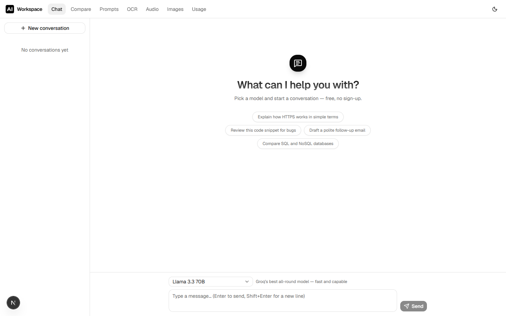

<p align="center">
  
</p>

<h1 align="center">AI Workspace</h1>

<p align="center">
  Free AI models in one place — chat, comparison, prompts, OCR, audio and images.<br>
  No sign-up, no billing, no tracking.
</p>

<p align="center">
  <a href="LICENSE"></a>
  
  
  
  
</p>



## What it does

| Page | Description |
|---|---|
| **Chat** | Streaming chat (SSE) with free models from Groq, OpenRouter and Gemini, with per-browser conversation history — no account needed |
| **Compare** | Ask once, get side-by-side answers from up to 3 models with latency and token stats |
| **Prompts** | Prompt library — built-in templates with `{{variables}}` plus your own, saved per session |
| **OCR** | Image → text with Tesseract.js, English + Bulgarian, **fully in the browser** — the image never leaves your machine |
| **Audio** | Speech-to-text (Whisper) and text-to-speech (Kokoro), **fully in the browser** via Web Workers + WASM |
| **Images** | Image generation UI — currently no free provider route exists (see note below) |
| **Usage** | Request, token and latency statistics for the last 7 days |

Sessions are anonymous: an httpOnly cookie gives each browser its own history. No accounts, no personal data.

## Stack

- **Next.js 16** (App Router, RSC, Route Handlers) · **React 19** · **Tailwind 4** · **shadcn/ui**
- **PostgreSQL** ([Neon](https://neon.tech)) · **Prisma 7** (`@prisma/adapter-pg`)
- **Redis 7** for rate limiting (in-memory fallback for dev)
- Model providers (free tiers only): **Groq**, **OpenRouter** (`:free` models), **Google Gemini**
- In-browser ML: **Tesseract.js** (OCR), **Whisper** + **Kokoro** via `@huggingface/transformers` / `kokoro-js` (ONNX, WASM)

## Getting started

Prerequisites: Node.js 20+, a Postgres database (a free [Neon](https://neon.tech) project works out of the box), and optionally Docker for Redis.

```bash
# 1. Configure environment
cp .env.example .env
#    → set DATABASE_URL / DIRECT_DATABASE_URL (Neon Postgres)
#    → fill in the API keys (all three are free):
#      GROQ_API_KEY       https://console.groq.com/keys
#      OPENROUTER_API_KEY https://openrouter.ai/settings/keys
#      GEMINI_API_KEY     https://aistudio.google.com/apikey

# 2. Optional: Redis for rate limiting (in-memory fallback without it)
docker compose up -d redis

# 3. Install and migrate
npm install
npx prisma migrate dev

# 4. Run
npm run dev
```

Missing API keys don't break the app — the affected endpoints return a friendly error message instead.

### Commands

| Command | Description |
|---|---|
| `npm run dev` | Dev server (Turbopack) |
| `npm run build` | Production build (needs the DB reachable — `/usage` is prerendered) |
| `npx prisma migrate dev` | Apply / create migrations |
| `npx prisma generate` | Regenerate the Prisma client (output is gitignored) |
| `npm run db:cleanup` | Data retention: drops 180-day-idle sessions and 90-day-old usage logs |
| `npx tsc --noEmit` | Type check |

## Architecture notes

| Path | Description |
|---|---|
| `src/lib/models.ts` | Model registry — add or replace models here, nothing else hardcodes model ids |
| `src/lib/providers.ts` | Streaming layer (Groq/OpenRouter via the `openai` package with `baseURL` override, Gemini via `@google/genai`) |
| `src/lib/ratelimit.ts` | Per-IP minute/day limits + global daily kill switch |
| `src/lib/session.ts` | Anonymous session cookie — all data access is scoped by it |
| `src/app/api/chat/route.ts` | SSE endpoint (`meta` → `delta`* → `done` \| `error`) with message + usage persistence |
| `src/components/audio/*-worker.ts` | Whisper and Kokoro Web Workers (kept separate — their ONNX runtimes conflict in one process) |

### Abuse protection

A public app running on shared free quotas needs guardrails. Every model-calling endpoint checks, in order: per-IP per-minute limit → per-IP per-day limit → global daily cap (kill switch). A denied request never consumes the next tier's quota. All three are tunable via env:

```
RATE_LIMIT_PER_MINUTE=10   RATE_LIMIT_PER_DAY=200   GLOBAL_DAILY_REQUEST_CAP=5000
```

### Privacy

- OCR and audio run entirely client-side — files never reach the server.
- Generated images are never stored — they return as data URLs; only a usage-log row remains.
- Old sessions and logs are purged by `npm run db:cleanup` (180 / 90 days).

### A note on image generation

As of July 2026 there is **no free image-generation route**: the Gemini API free tier no longer includes image models, and OpenRouter's catalog has no free image-output models. The Images page ships anyway and returns a graceful error until a free provider appears — model registries live in `src/lib/models.ts`, so wiring one up is a one-line change.

## License

[MIT](LICENSE)
